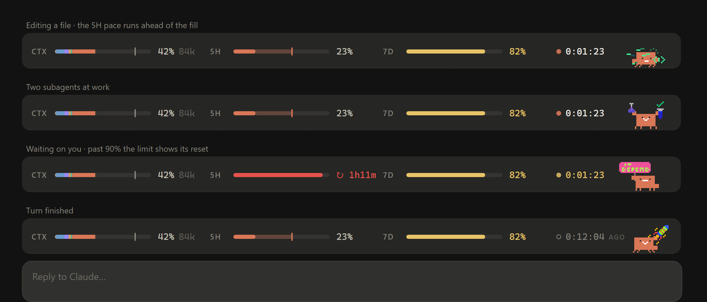

<div align="center">

# clawd-bar

**A tiny pixel Claude lives above your prompt and acts out whatever Claude Code is doing.**

It shows context, usage limits and the turn clock at a glance, in one slim bar. Dark mode first, light mode supported.



[Install](#install) · [What it reacts to](#what-it-reacts-to) · [Commands](#the-clawd-command) · [How it works](#how-it-works) · [Customize](#customize) · [Credits](#credits)

</div>

---

## What you get

A 52px bar above the input box in the **Claude Code desktop app**. It has two layers.

**Behind: the numbers.** Each slot has a fixed width so nothing jumps around. On a narrow window the three meters get shorter together; they're never dropped.

| Slot | Shows |
| --- | --- |
| `CTX` | Context window fill, as a bar split by **what** is filling it: messages, system tools, MCP tools, memory files, skills. A tick marks where **auto-compact** kicks in. After each turn, the change (`+12k`) floats up from the number. Hover for the token breakdown. |
| `5H` | Your 5-hour usage limit, with your **pace**: a faint extension of the bar and a tick show where you'll be at the reset. The tooltip says "100% in ~40m" if you'll hit the limit first. |
| `7D` | Your weekly limit. |
| clock | ● counts how long the current turn has run. It turns **yellow and pulses faster when Claude is waiting on you** (a permission prompt or a question). ○ counts how long ago the last turn finished. |

Every meter uses one colour rule: Claude orange, **yellow from 75%**, **red from 90%**. Past 90% a limit shows its reset countdown (`↻ 1h12m`) instead of the percentage, because that's the number you need then.

**In front: Clawd.** Claude's pixel mascot wanders the bar. When Claude picks up a tool, he stops and poses for it.
**Click him** and he hops and reacts. **Hover him** and he says what Claude is doing right now, like `editing hud.ts` or `$ npm test`.

## What it reacts to

All 75 poses of the mascot pack are used.

| When Claude… | Clawd… |
| --- | --- |
| is thinking | thought bubble, lightbulb, logic symbols |
| reads files | scroll, document, long log, audit clipboard |
| searches (`Grep`, `Glob`) | magnifier, globe, tree, data blocks |
| edits or writes code | keyboard, code sparkles, building blocks |
| runs tests or linters | lab flasks, bug hunting |
| runs `git` | branch tree, many windows |
| installs or builds | stacking blocks, wrench, server stacks |
| deletes or cleans | sweeps with a broom |
| uses ssh, docker or servers | server racks |
| browses the web | globe, API badge |
| starts subagents | pair programming, and a half-size Clawd trots alongside for each running subagent |
| uses a skill | wizard hat, ninja, glowing aura |
| touches secrets or auth | padlock, shield, malware scanner |
| asks you a question or waits on a permission | holds an "IT DEPENDS" sign and asks "your call?" |
| runs over 3 minutes | lifts a barbell, runs in loops |
| finishes a turn | checkmark, rocket, trophy, celebration |
| hits a tool error | error windows, confusion spiral, debugging |
| gets denied, interrupted, or fails | padlock, broken heart, tears, dizzy |
| compacts the context | sync arrows |
| is near a limit | angry coffee, lightning |
| is idle | gardens, bakes pie, meditates, lifts, then sleeps after 10 quiet minutes |

## Install

**You need** the Claude Code **desktop app** and the free mascot art.

**1. Get the art.** Download the free **[Claude Mascot Pack](https://getillustrations.com/illustration-pack/claude-mascot-pack)** from GetIllustrations (no account needed).
Unzip it into **Downloads**, **Desktop** or **Documents**. The mod finds it there on its own.
The art isn't bundled here because its license doesn't allow redistributing the pack.

**2. Install the plugin.** Either paste this into Claude Code:

```text
Install clawd-bar for me from https://github.com/DevVaradPatil/clawd-companion, following its SETUP.md.
```

…or run this at the prompt of a terminal `claude` session:

```text
/plugin install clawd-bar --marketplace DevVaradPatil/clawd-companion
```

**3. Restart the desktop app.** Clawd says hi in every new session.

If the pack is somewhere else, run `/clawd pack <folder>` once. The first time, the mod compiles the 75 SVGs and caches them, so later sessions start instantly.

> Mods use Claude Code's early-access function-hooks API. If the bar doesn't appear, set `"CLAUDE_CODE_ENABLE_FUNCTION_HOOKS": "1"` under `env` in `~/.claude/settings.json` (the setup prompt does this for you).

## The `/clawd` command

| Command | Does |
| --- | --- |
| `/clawd` | Status: on or off, size, where the art came from |
| `/clawd off` · `/clawd on` | Hide or show the bar |
| `/clawd compact` | Clawd only, no stats (run it again to bring them back) |
| `/clawd size 1` · `1.5` · `2` | Clawd's size (the bar grows to fit) |
| `/clawd pack <folder>` | Where the unzipped mascot pack is |
| `/clawd motion on` · `auto` · `off` | Always move (default), follow your OS's reduced-motion setting, or stand still |
| `/clawd poke` | Say hi |

Settings are kept across sessions.

**Light mode and reduced motion.** The bar follows your system's light or dark appearance.
With `/clawd motion auto`, Clawd stands still whenever your OS asks for reduced motion, and the floating numbers stay off. It isn't the default because Windows reports reduced motion whenever "Show animations" is off, which many people turn off for speed.

## How it works

clawd-bar is a Claude Code **mod**, a plugin of function hooks. It runs alongside the session and draws into the band above the prompt.

- **One SVG, animated by the browser.** The whole bar, stats and mascot, is one SVG with SMIL animation.
  The mod plans a "scene" (walk here, pose there, say this) and compiles it once.
  The desktop app then animates it with no per-frame work from the mod.
- **Resumes mid-scene.** When the numbers change, the SVG is rebuilt with a negative `begin`, so Clawd carries on from where he was instead of teleporting.
- **Clocks that tick themselves.** The timer is seven digit "wheels" started in the past. It counts every second without a single redraw.
- **Reacts to real events.** `tool.call`, `turn.start`/`turn.complete`, `session.compact` and `session.measure` drive the mood.
  `$.session.usage()` supplies context, its per-category breakdown, and the rate limits.
- **Click and hover stay inside the SVG** (`begin="clawd.click"`, `clawd.mouseover`), so they respond instantly with no round trip.
- **The art is compiled on your machine.** At startup the mod finds your copy of the pack and turns each 2000×2000 SVG (one `<rect>` per pixel) into a few compact `<path>`s.
  It anchors every pose at the mascot's feet and splits the walking body's legs into two pairs for a step cycle.
  The result, about 180 KB, is cached until the pack changes.

```
.claude-plugin/       marketplace.json, so the repo installs with /plugin install
clawd-bar/            the mod
  hooks/register.tsx  events → mood → scene, /clawd, finding and caching the art
  hooks/compile.ts    pack SVGs → compact sprites
  hooks/stage.ts      scene planning and the SVG/SMIL compiler
  hooks/hud.ts        the stats layer
  hooks/poses.ts      which poses mean what, and tool classification
  tests/              plugin tests (claude plugin test clawd-bar)
tools/
  preview.ts          renders the bar to an HTML page for quick iteration
```

## Customize

| Want | Change |
| --- | --- |
| A bigger mascot | `/clawd size 1.5` or `2` |
| Different poses for a tool | the lists in `hooks/poses.ts` |
| Different colours | `C` and `CAT_COLOR` in `hooks/hud.ts`; `LIGHT` in `hooks/stage.ts` for light mode |
| Warning thresholds | `WARN` (75) and `DANGER` (90) in `hooks/hud.ts` |
| A bar that's too wide or narrow | `CELL_PX` in `hooks/register.tsx` (the desktop's cell width in CSS px) |
| Faster or slower walking | `SPEED` in `hooks/stage.ts` |
| Preview without restarting | `node tools/preview.ts <pack folder> preview.html`, then open it in a browser |

## Limits

- **Desktop app only.** The bar is SVG, which the terminal can't draw, so the CLI shows nothing.
- **Early-access API.** Mods use Claude Code's function-hooks API, which is early access and may change between releases.
- **Usage limits need a subscription.** The 5h and 7d figures appear once the API reports them (Pro/Max plans). Until then the slots show `—`.

## Credits

- **Illustrations:** the [**Claude Mascot Pack**](https://getillustrations.com/illustration-pack/claude-mascot-pack) by [**GetIllustrations.com**](https://getillustrations.com).
  It's used under [their license](https://getillustrations.com/license) and isn't redistributed in this repository.
  If you like the art, check out their other pixel packs.
- **Code:** MIT, see [LICENSE](LICENSE). That covers the code only, not the illustrations.

clawd-bar is an unofficial fan project. It isn't affiliated with, endorsed by, or sponsored by Anthropic. "Claude" is a trademark of Anthropic, PBC.
